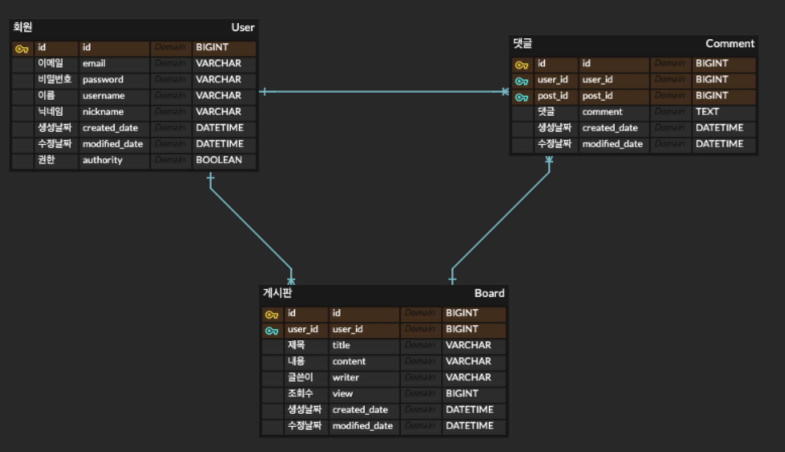
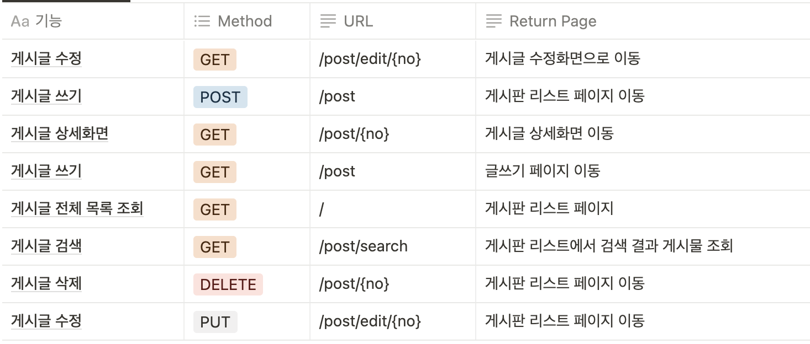
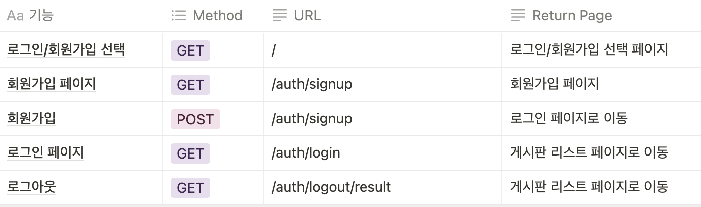

# Basic Board Project
> 웹의 기본을 다 넣을 수 있는 게시판 프로젝트! 

## 목차
- 들어가며
  - 프로젝트 소개
  - 프로젝트 기능
  - 사용기술
    - 백엔드
    - 프론트엔드

- 구조 및 설계
  - DB 설계
  - API 설계

- 마치며
  - 보완사항
  - 후기

## 들어가며
### 1. 프로젝트소개
JAVA를 기반으로 웹의 기본을 다 넣을 수 있는 게시판 프로젝트를 만들며 배우기 위해 시작했습니다.
Bootstrap과 thymeleaf를 사용해서 프론트를 간단히 제작.
### 2. 프로젝트 기능
**게시판:** CRUD, 조회수, 페이징, 검색  
**사용자:** Security, jwt 회원가입 및 로그인, 회원정보 수정, 회원가입시 유효성 검사 및 중복 검사  
**댓글:** CRUD  

**미구현:** jwt, 권한별(USER, ADMIN)접속 가능 여부, 댓글

### 3. 사용기술
#### 백엔드
  - JAVA11, SpringBoot, JPA(Spring Data JPA), Spring Security, Gradle, mysql  
#### 프론트엔드
  - Html/Css, Javascript, Bootstrap, thymeleaf

### 4. 구조 및 설계

  
DB 설계

  
#### API 설계

### 5. 마치며
  - #### 보완사항
    1. 로그인 한 사람만 글쓰기 가능
    2. 작성자, 관리자만 글 수정, 삭제 가능하게 하기
    3. 글 삭제시 글 번호 재 정렬
    4. 페이징 처리 정확히(1페이지 글 10개씩)

  - ##### 후기

/2023.1.3
